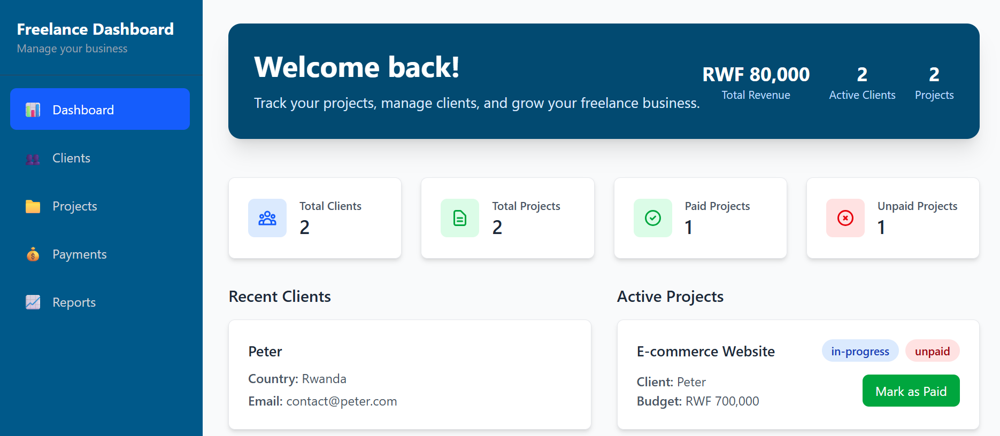
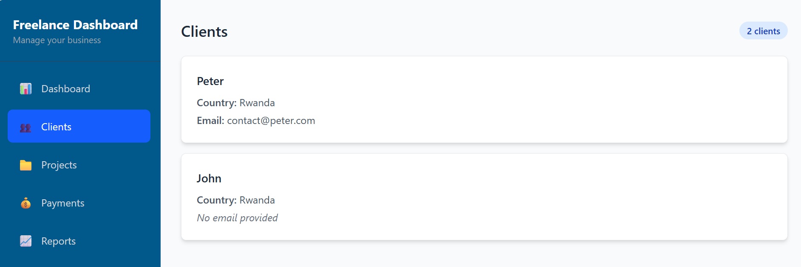

# Freelance Management Dashboard

A simple and organized tool to help freelancers manage their business. Keep track of clients, projects, and payments all in one place.

## What This Does

This dashboard helps you:
- *** Manage Clients** - Store client information and contact details
- *** Track Projects** - See project status and what needs attention  
- *** Monitor Payments** - Know who has paid and who hasn't
- *** View Business Stats** - See your earnings and project counts at a glance

## Who This Is For

Perfect for:
- Freelancers working with multiple clients
- Small business owners managing projects
- Anyone who needs to track work and payments
- People tired of using spreadsheets and notes

## Key Features

- **Easy to Use** - Clean, simple interface
- **Everything in One Place** - No more searching through emails
- **See Your Business** - Understand how your business is doing
- **Mark Projects Paid** - One click to record payments
- **Works on All Devices** - Desktop, tablet, and mobile

## Quick Look

- Add your clients with their information
- Create projects and set their status
- Mark projects as paid when clients pay you
- See all your business information on the dashboard

## Technology Used

- React with TypeScript for a reliable app
- Tailwind CSS for beautiful design
- Modern web development practices

** Stop juggling multiple tools and notes. Get organized with this simple dashboard!*

- **Frontend**: React 19, TypeScript
- **Styling**: Tailwind CSS
- **Build Tool**: Vite
- **Package Manager**: npm

Open [http://localhost:5173](http://localhost:5173) in your browser.

